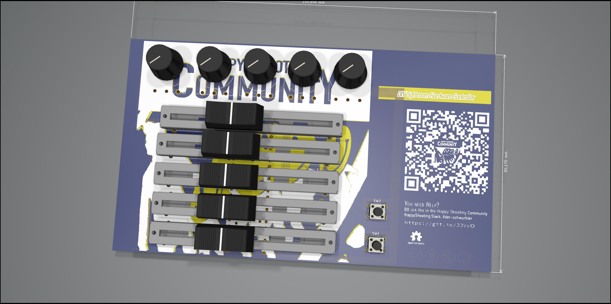
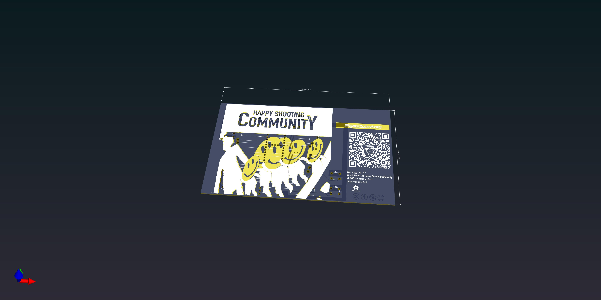

# hs-lr-midi-schwurbler
Happy Shooting Community - DIY Lightroom Hardware Controller

## Description
The german foto podcast legend Happy Shooting had a discussion about Midi controller for Lightroom. One comment on the website and voila a new project is born.
This project will (hopefully) contain everything from zero to hero to get create your own customized Midi Controller for Lightroom.
It is completly community driven, so everyone is allowed to contribute. And is not intended to earn money with it. Just from the community for the community.

## Status of the project
It's just a very first glympse, and totally work in progress.

## Structure
### Circuit Diagram
 Consists of circuit diagrams. The basic wiring logic.

### Code
 Consists of the sourcecode for the mcu
 * The teensy version used the manufactors [MIDI Libary](https://www.pjrc.com/teensy/td_libs_MIDI.html)

### Componentlist
 Consists of the list of used components for each version

### Kicad
  Consists of the kicad projects - The mother of the Diagrams, Layouts and renderings.

### PCB
 Consits of Gerber, Etching and Renders
 They can be used to order pcbs from a manufactorer

### Prototyping
 Consits of [Fritzing](https://fritzing.org/) files that can be easly recreated on a breadboard.

### Tutorial
 tbd

***

## Versions
### USB Midi Version
* based on the Teensy Devboards
* USB Powered
* uses usb midi interface of the hardware

### BLE / Wifi Midi Versions
* based on a ESP32 Devboard
* 18650 battery powered
* uses Apple MIDI / RTP MIDI or Multicast UDP to send Midi messages over Multicast UDP ( undecided )

### Open questions
What should be created
* How many poti from which type
* How many buttons
* What size is prefered - Handsoldering, smd or whatever
* Components used - cheaper or better
* MCU - The battery powered bluetooth wifi vesion or the buspowered usb-midi vesion

## How to contribute
* fork, add, push, create a pull request
* create an issue on github
* just ask in slack

## License
* All layouts and diagrams are CC sharealike noncommercial attribution 4.0 licensed
So you can create and use them on your own even in your company, but you are not allowed to sell them.

 Dieses Werk ist lizenziert unter einer <a rel="license" href="http://creativecommons.org/licenses/by-nc-sa/4.0/">Creative Commons Namensnennung - Nicht-kommerziell - Weitergabe unter gleichen Bedingungen 4.0 International Lizenz</a>.

## Disclaimer
THE SOFTWARE IS PROVIDED "AS IS", WITHOUT WARRANTY OF ANY KIND, EXPRESS OR IMPLIED, INCLUDING BUT NOT LIMITED TO THE WARRANTIES OF MERCHANTABILITY, FITNESS FOR A PARTICULAR PURPOSE AND NONINFRINGEMENT. IN NO EVENT SHALL THE AUTHORS OR COPYRIGHT HOLDERS BE LIABLE FOR ANY CLAIM, DAMAGES OR OTHER LIABILITY, WHETHER IN AN ACTION OF CONTRACT, TORT OR OTHERWISE, ARISING FROM, OUT OF OR IN CONNECTION WITH THE SOFTWARE OR THE USE OR OTHER DEALINGS IN THE SOFTWARE.
