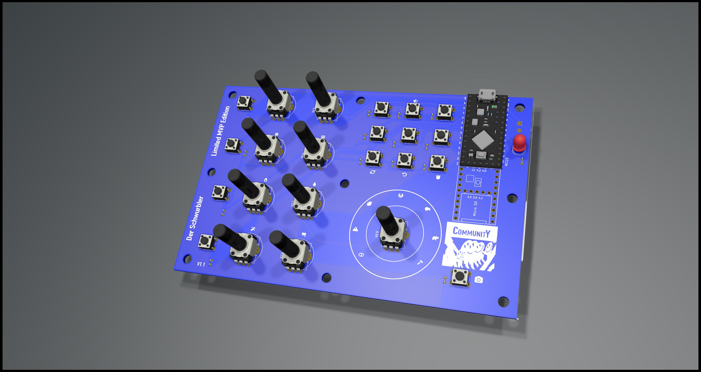

# Der Schwurbler

Happy Shooting Community - DIY Lightroom Hardware Controller

## Description
The german foto podcast legend Happy Shooting had a discussion about Midi controller for Lightroom. One comment on the website and voila a new project is born.
This project will (hopefully) contain everything from zero to hero to get create your own customized Midi Controller for Lightroom.
It is completly community driven, so everyone is allowed to contribute. And it's not intended to earn money with it. Just from the community for the community.
In general you might even need no case, just the pcb with the solded parts. so you will get an extra small extra lightwight device. If that's the thing for you we might even go the capacitive way and reduce the soldered components and weight to a minimum.

## MVP Video

<object width="425" height="350">
  <param name="movie" value="https://youtu.be/SjJDIjGQ-qA" />
  <param name="wmode" value="transparent" />
  <embed src="https://youtu.be/SjJDIjGQ-qA"
         type="application/x-shockwave-flash"
         wmode="transparent" width="425" height="350" />
</object>

https://youtu.be/SjJDIjGQ-qA

## WIKI
You can find our wiki here https://github.com/mommel/hs-lr-midi-schwurbler/wiki

## Status of the project
Released a version and onging development for next versions

### Tutorial
 *To be found soonish in the Wiki*

## Versions
### MVP
* based on Teensy 32bit boards
* USB Powered
* 10 + 4 Buttons
* 9 Poti

## Releases
* [MVP Version](https://github.com/mommel/hs-lr-midi-schwurbler/releases/tag/v1.0.0) released

## Help needed? F.A.Q.
* For support you can open an issue here on github.
* Maybe there will be a slack contact in the future.
* This project is a Happy Shooting _Community_ Project.
The best way to get help is joining the #der-schwurbler channel on the happyshooting slack. The community will do it's best and hopefully solve your issue.
* No hotline, no helpdesk. But we have something even greater: The Happy Shooting _Community_.

## How to contribute
* Fork, add, push, create a pull request
* create an issue on github
* You don't want to use Eagle, Kicad or Fritzing to create a layout. It's totally fine, as long the result can be used to create a PCB with no additional costs to the version created with the other software.

## How can I get one?
* Decide the version, take the Gerber Folder and bom.csv matching your decission. Upload the gerber Files to the manufacturer of your most trust. Mine are some even in china and even there is the delivery time below a week.

## License
* All layouts and diagrams are CC share alike non commercial attribution 4.0 licensed
So you can create and use them on your own even in your company, but you are not allowed to sell them.

 Dieses Werk ist lizenziert unter einer <a rel="license" href="http://creativecommons.org/licenses/by-nc-sa/4.0/">Creative Commons Namensnennung - Nicht-kommerziell - Weitergabe unter gleichen Bedingungen 4.0 International Lizenz</a>.
Namensnennung/Attribution to Happy Shooting Community https://happyshooting.de/community-projekte/

### Contributors in alphabetical order
chrismarquardt https://github.com/chrismarquardt
Mac ThreeZee https://github.com/MacThreeZee
Mommel https://github.com/mommel
Vielpixel https://github.com/Vielpixel
wolfgangSF https://github.com/wolfgangSF

# 3rd party licenses
External work have their own licenses and are covered or even touched by owner license.

## assets/SolderComics
* FullSolderComic_EN.pdf is licensed as https://creativecommons.org/licenses/by-sa/3.0 by Mitch Altmann, Andie Nordgren and Jeff Keyzer
* DE_SolderComic.pdf is licensed as https://creativecommons.org/licenses/by-sa/3.0 by Mitch Altmann, Andie Nordgren, Jeff Keyzer, Alexander Bodora and Richard Meinsen

## kicad/parts
### pretty _footprints_
_as submodule_
* XenGi_teensy.pretty is licensed under the MIT License by Ricardo Band
### lib _libraries_
_as submodule_
* XenGi_teensy_library is licensed under the MIT License by Ricardo Band

## Disclaimer
THE SOFTWARE IS PROVIDED "AS IS", WITHOUT WARRANTY OF ANY KIND, EXPRESS OR IMPLIED, INCLUDING BUT NOT LIMITED TO THE WARRANTIES OF MERCHANTABILITY, FITNESS FOR A PARTICULAR PURPOSE AND NONINFRINGEMENT. IN NO EVENT SHALL THE AUTHORS OR COPYRIGHT HOLDERS BE LIABLE FOR ANY CLAIM, DAMAGES OR OTHER LIABILITY, WHETHER IN AN ACTION OF CONTRACT, TORT OR OTHERWISE, ARISING FROM, OUT OF OR IN CONNECTION WITH THE SOFTWARE OR THE USE OR OTHER DEALINGS IN THE SOFTWARE.
